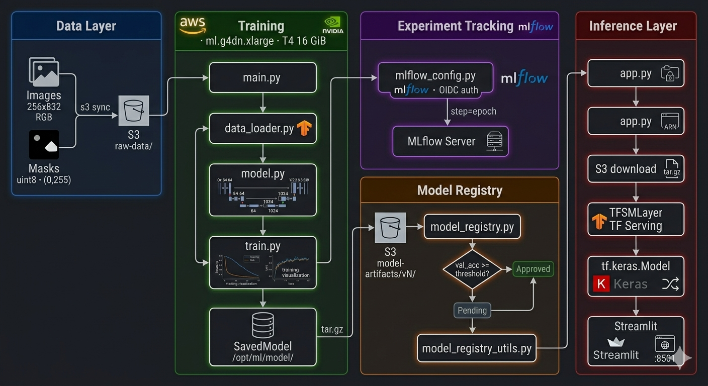
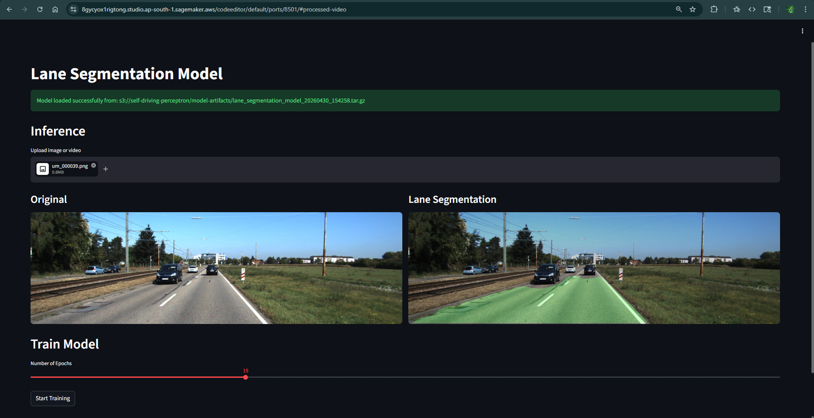
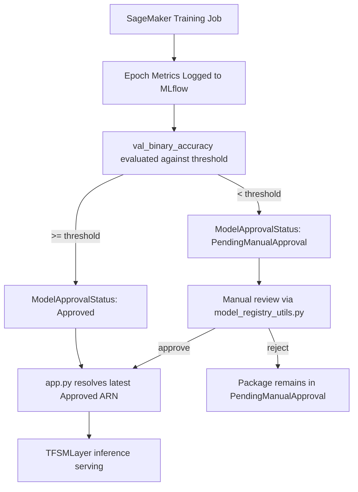
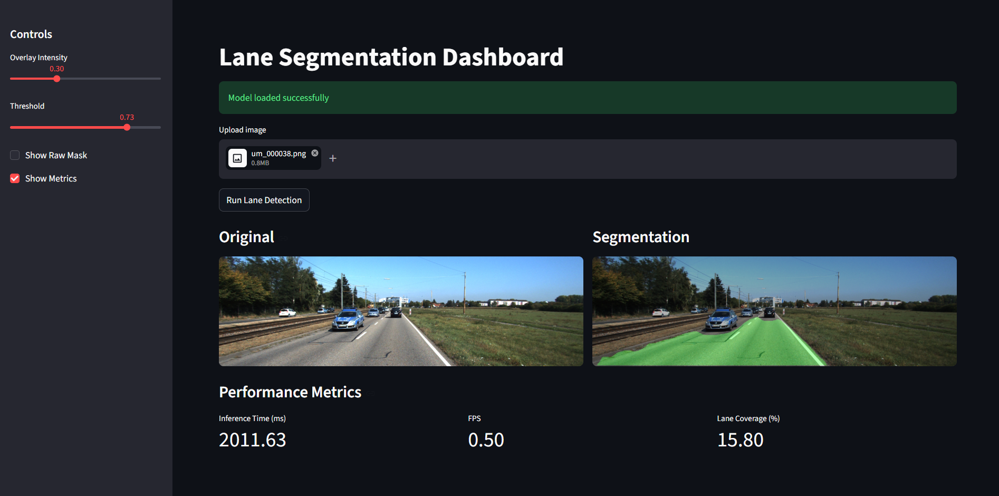

<h1 align="center">Lane Segmentation MLOps Pipeline on Amazon SageMaker</h1>

<p align="center">
  <a href="https://tensorflow.org/">
    
  </a>
  <a href="https://aws.amazon.com/sagemaker/">
    
  </a>
  <a href="https://mlflow.org/">
    
  </a>
  <a href="https://python.org/">
    
  </a>
</p>

<p align="center">
  
</p>

<p align="center">
  Pixel-level binary semantic segmentation of lane boundaries using a fully-convolutional U-Net encoder-decoder trained on 289 annotated road images. The pipeline integrates SageMaker Training Jobs, SageMaker Model Registry with threshold-gated approval, MLflow experiment tracking, and a Streamlit inference frontend backed by TFSMLayer-wrapped SavedModel artifacts.
</p>

<h2 align="center">Architecture</h2>

<h3 align="center">Model</h3>

Symmetric encoder-decoder (U-Net) with lateral skip connections between mirrored resolution stages. Skip connections concatenate encoder feature maps directly into the decoder path, preserving high-frequency spatial detail lost during max-pooling downsampling.

<p align="center">

  | Component | Specification |
  |---|---|
  | Input tensor | `(N, 256, 832, 3)` — float32, normalized to `[0, 1]` |
  | Encoder depth | 4 stages — filter progression `[64, 128, 256, 512]` |
  | Bottleneck | 1024 filters, no spatial downsampling |
  | Decoder depth | 4 stages — filter progression `[512, 256, 128, 64]` |
  | Upsampling | Bilinear interpolation (`unpool='bilinear'`) |
  | Output | `(N, 256, 832, 1)` — sigmoid activation, binary mask |
  | Loss | Sørensen–Dice coefficient: `L = 1 - (2·|X∩Y| + ε) / (|X| + |Y| + ε)` |
  | Optimizer | Adam, `lr=1e-4`, default β₁=0.9, β₂=0.999 |
  | Metrics | Binary accuracy, Mean IoU (`num_classes=2`) |

</p>

Dice loss is preferred over binary cross-entropy here due to severe foreground/background class imbalance — lane pixels constitute a small fraction of total image area, causing BCE to converge to a degenerate all-background solution.

<h3 align="center">Infrastructure</h3>

```yaml
Compute:
  instance_type: ml.g4dn.xlarge       # 4 vCPU, 16 GiB RAM, 1x NVIDIA T4 (16 GiB VRAM)
  framework_version: "2.11.0"          # TF 2.11 — last version with Keras 2 API
  container: AWS Deep Learning Container (763104351884.dkr.ecr.<region>.amazonaws.com)

Storage:
  training_data: s3://<bucket>/raw-data/          # 289 RGB images + 289 binary masks
  model_artifacts: s3://<bucket>/model-artifacts/ # versioned tar.gz SavedModel archives
  experiment_logs: SageMaker MLflow Tracking Server

Orchestration:
  training: SageMaker Training Jobs (managed spot optional)
  registry: SageMaker Model Registry (ModelPackageGroup: lane-segmentation-models)
  tracking: SageMaker MLflow Apps (OIDC-authenticated tracking server)
```

<h2 align="center">Repository Structure</h2>

```
lane-segmentation-pipeline/
├── src/
│   ├── train.py              # Training loop, checkpointing, S3 artifact upload, registry registration
│   ├── model.py              # U-Net graph construction via keras-unet-collection
│   ├── data_loader.py        # tf.data pipeline: decode → resize → normalize → augment → batch
│   ├── mlflow_config.py      # MLflow client init, run context manager, param/metric logging
│   ├── model_registry.py     # SageMaker boto3 calls: create_model_package, list_model_packages
│   └── requirements.txt
├── config/
│   ├── model.yaml            # Hyperparameters, data config, approval threshold
│   └── train.yaml            # SageMaker instance config, S3 paths, job name prefix
├── dataset/
│   ├── image/                # 289 × RGB road frames (variable resolution, resized to 256×832)
│   └── mask/                 # 289 × binary lane masks (uint8, values ∈ {0, 255})
├── assets/
│   ├── ui.png
│   └── output.mp4
├── models/                   # Local SavedModel cache (populated by app.py on first load)
├── app.py                    # Streamlit frontend: inference, registry status, job launcher
├── main.py                   # SageMaker Estimator configuration and .fit() invocation
├── model_registry_utils.py   # CLI wrapper: list packages, patch approval status
└── MODEL_REGISTRY.md
```

<h2 align="center">Environment Setup</h2>

**Requirements:** AWS account with `sagemaker:*`, `s3:*`, `iam:PassRole` permissions; Python ≥ 3.9; AWS CLI v2.

```bash
git clone https://github.com/nasim-raj-laskar/lane-segmentation-pipeline.git
cd lane-segmentation-pipeline/
pip install -r src/requirements.txt
```

Create a `.env` file:

```bash
AWS_ACCOUNT_ID=<account-id>
AWS_REGION=<region>
S3_BUCKET=<bucket>
SAGEMAKER_ROLE=SageMakerExecutionRole
MLFLOW_ARN=arn:aws:sagemaker:<region>:<account>:mlflow-tracking-server/<server-name>
```

```bash
# Sync raw dataset to S3 input channel
aws s3 sync dataset/ s3://<bucket>/raw-data/
```

<h2 align="center">Training</h2>

<h3 align="center">Launch SageMaker Training Job</h3>

```bash
python main.py
```

This instantiates a `sagemaker.tensorflow.TensorFlow` estimator targeting `ml.g4dn.xlarge`, injects `config/model.yaml` hyperparameters as `--hyperparameters`, and calls `.fit()` with the S3 data channel. Training artifacts are written to `/opt/ml/model/` inside the container and automatically uploaded to S3 on job completion.

<h3 align="center">Hyperparameter Reference (config/model.yaml)</h3>

```yaml
epochs: 15
batch_size: 4                  # constrained by T4 VRAM at 256×832 resolution
learning_rate: 0.0001
accuracy_threshold: 0.85       # minimum val_binary_accuracy for auto-approval
img_height: 256
img_width: 832
normalization_factor: 255.0
mask_threshold: 255            # binarization cutoff for mask preprocessing
test_size: 0.2
random_state: 42
s3_bucket: <bucket>
s3_model_prefix: model-artifacts/lane_segmentation_model
timestamp_format: '%Y%m%d_%H%M%S'
```

<h3 align="center">Infrastructure Configuration (config/train.yaml)</h3>

```yaml
sagemaker:
  instance_type: ml.g4dn.xlarge
  instance_count: 1
  framework_version: "2.11.0"
  py_version: py39

s3:
  bucket: <bucket>
  data_path: raw-data
  model_artifacts_path: model-artifacts
  code_location: code

training:
  job_name_prefix: lane-segmentation-training
```

<h2 align="center">Model Registry</h2>

<h3 align="center">Approval Gate Logic</h3>

Post-training, `src/model_registry.py` calls `sagemaker:CreateModelPackage`. Approval status is determined by comparing `final_val_accuracy` against `accuracy_threshold`:

```python
def register_model(self, model_s3_uri, metrics, accuracy_threshold=0.8):
    val_accuracy = metrics.get('final_val_accuracy', 0)
    approval_status = "Approved" if val_accuracy >= accuracy_threshold else "PendingManualApproval"

    self.sagemaker.create_model_package({
        'ModelPackageGroupName': 'lane-segmentation-models',
        'ModelApprovalStatus': approval_status,
        'InferenceSpecification': {
            'Containers': [{
                'Image': f'763104351884.dkr.ecr.{region}.amazonaws.com/tensorflow-inference:2.12-cpu',
                'ModelDataUrl': model_s3_uri
            }]
        }
    })
```

For stricter multi-criteria gating (val_loss + Mean IoU):

```python
approval_status = "Approved" if (
    val_accuracy >= accuracy_threshold and
    val_loss < 0.3 and
    mean_iou > 0.7
) else "PendingManualApproval"
```

<h3 align="center">CLI Operations</h3>

```bash
# Enumerate all model package versions with approval status and metrics
python model_registry_utils.py

# Patch approval status on a specific model package ARN
python model_registry_utils.py approve \
  arn:aws:sagemaker:<region>:<account>:model-package/lane-segmentation-models/1
```

<h3 align="center">S3 Artifact Layout</h3>

```
s3://<bucket>/model-artifacts/lane_segmentation_model/
├── v1/
│   ├── 20240430_143022.tar.gz   # TensorFlow SavedModel (saved_model.pb + variables/)
│   └── metrics.json
├── v2/
│   ├── 20240430_150145.tar.gz
│   └── metrics.json
└── v3/
    ├── 20240430_152301.tar.gz
    └── metrics.json
```

`metrics.json` schema:

```json
{
  "final_train_loss": 0.6542,
  "final_val_loss": 0.4382,
  "final_train_accuracy": 0.3605,
  "final_val_accuracy": 0.8366,
  "epochs": 15,
  "batch_size": 4,
  "learning_rate": 0.0001,
  "timestamp": "20240430_164055",
  "version": 3
}
```

<h2 align="center">Inference Application</h2>

<h3 align="center">Model Loading</h3>

`app.py` resolves the latest `Approved` model package ARN via `list_model_packages`, downloads the SavedModel artifact from S3, and wraps it in a `TFSMLayer` to maintain Keras 3.x functional API compatibility (Keras 3 dropped native `tf.saved_model.load` integration):

```python
@st.cache_resource
def load_model():
    registry = ModelRegistry()
    model_s3_uri, model_package_arn = registry.get_latest_approved_model()

    model_layer = tf.keras.layers.TFSMLayer(
        'models/approved/1',
        call_endpoint='serving_default'
    )
    inputs = tf.keras.Input(shape=(256, 832, 3))
    outputs = model_layer(inputs)
    return tf.keras.Model(inputs=inputs, outputs=outputs), model_package_arn
```

<h3 align="center">Launch</h3>

```bash
streamlit run app.py --server.port 8501 --server.address 0.0.0.0
```

<p align="center">
  
  <br/>
  <em>Streamlit frontend: image upload → TFSMLayer inference → binary mask overlay. Registry status and training job launcher rendered in the sidebar.</em>
</p>

<h2 align="center">MLOps Lifecycle</h2>



<h2 align="center">Experiment Tracking</h2>

MLflow run context is opened in `src/train.py` before the Keras `.fit()` call. Hyperparameters are logged once; per-epoch metrics are logged with `step=epoch` for time-series visualization in the MLflow UI:

```python
with mlflow.start_run(run_name=f"lane_seg_{timestamp}"):
    mlflow.log_params({
        'epochs': config['epochs'],
        'batch_size': config['batch_size'],
        'learning_rate': config['learning_rate']
    })
    for epoch in range(epochs):
        mlflow.log_metrics({
            'train_loss': history.history['loss'][epoch],
            'val_loss': history.history['val_loss'][epoch],
            'train_accuracy': history.history['binary_accuracy'][epoch],
            'val_accuracy': history.history['val_binary_accuracy'][epoch]
        }, step=epoch)
```

Tracked metrics: Dice loss, binary cross-entropy, binary accuracy, Mean IoU, epoch wall-clock time, GPU utilization, peak VRAM allocation, total parameter count, SavedModel size on disk, and batch inference latency (p50/p95).

<h2 align="center">Interactive Demo (Hugging Face Spaces)</h2>

<p align="center">
  
  <br/>
  <em>Lightweight interactive dashboard deployed on Hugging Face Spaces for real-time inference and visualization. Includes adjustable thresholding, overlay tuning, and performance metrics.</em>
</p>

<p align="center">
  👉 <a href="https://huggingface.co/spaces/Nasim435/Lane-seg">Try Live Demo</a>
</p>

<h2 align="center">References</h2>

- [SageMaker `CreateModelPackage` API](https://docs.aws.amazon.com/sagemaker/latest/APIReference/API_CreateModelPackage.html)
- [MLflow Tracking Server](https://mlflow.org/docs/latest/tracking.html#mlflow-tracking-servers)
- [TensorFlow SavedModel format](https://www.tensorflow.org/guide/saved_model)
- [U-Net: Convolutional Networks for Biomedical Image Segmentation](https://arxiv.org/abs/1505.04597)
- [V-Net / Dice Loss](https://arxiv.org/abs/1606.04797)

